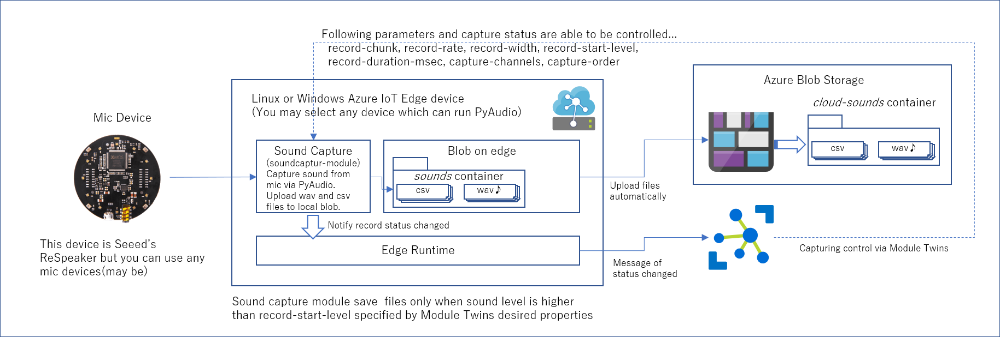

# Mic Capture IoT Sound Sample 
本サンプルは、Azure IoT Edge対応デバイスに接続されたマイクデバイスから、音をキャプチャーし、キャプチャーした音データを、WAVファイルとCSVファイルで保存する、Azure IoT Edge Module と、そのモジュールを使って、クラウドへのファイルアップロードや、アップロードされた音データを基にしたAI構築と学習済みAIモデルの利用、及び、学習済みAIモデルの、Azure IoT Edge対応デバイスへのデプロイと活用までを例示する。 

本サンプルは、以下のステップで作業を進める。 

1. [実施に必要な下準備](#step-0---実施に必要な下準備) 
1. [マイクデバイスから音をWAVファイル、CSVファイル形式でキャプチャーし、クラウドにアップロードする](#step-1---マイクデバイスから音をwavファイルcsvファイル形式でキャプチャーしクラウドにアップロードする)
1. [クラウド上での音データを使ったAIの構築と、学習済みAIの利用](#step-2---クラウド上での音データを使ったaiの構築と学習済みaiの利用) 
1. [学習済みモデルを Azure IoT Edge 上に配置](#step-3---学習済みモデルを-azure-iot-edge-上に配置) 

---

## Step 0 - 実施に必要な下準備 
本サンプルを実際に試す場合には、まず、以下の環境を整えること。 
### ハードウェア 
※ ここで紹介している以外のハードウェアを利用する場合には、各自の環境において、IoT Edge Module の配置設定や、Module Twins のパラメータを調整してください（コントリビューションしてくれるとありがたし 

- Raspberry Pi 3 Model B+ 以上 - [Azure IoT Edge のセットアップ](https://docs.microsoft.com/ja-jp/azure/iot-edge/how-to-install-iot-edge-linux)を参考に、Azure IoT Edge Runtimeをセットアップすること
- [ReSpeaker Mic Array V2.](http://wiki.seeedstudio.com/ReSpeaker_Mic_Array_v2.0/) - そこらによくあるUSBマイク等でもOK（のはず） 

※ ReSpeaker は、6_channels_firmware.bin のファームウェアを利用すること

### 利用する Microsoft Azure 
- Azure Subscription - [無料お試しでも可](https://azure.microsoft.com/ja-jp/free/) 
- [Azure IoT Hub](https://docs.microsoft.com/ja-jp/azure/iot-hub/) - Azure で IoT を実現するためのコアサービス
- [Azure Container Registry](https://docs.microsoft.com/ja-jp/azure/container-registry/) - プライベートDocker Hub
- [Azure Storage Blob](https://docs.microsoft.com/ja-jp/azure/storage/blobs/storage-blobs-introduction) - クラウドでとりあえずファイルを保持するならこれ 
- [Azure Machine Learning](https://azure.microsoft.com/ja-jp/services/machine-learning/) 

### 開発環境 
- PC（Windows PC、MAC、Linux何でも可) 
- [Git](https://git-scm.com/)
- [Docker Engine](http://docs.docker.jp/engine/index.html)
- [VS Code](https://code.visualstudio.com/) 
- Azure IoT Edge Module 開発環境 - [IoT Edge 開発チュートリアル](https://docs.microsoft.com/ja-jp/azure/iot-edge/tutorial-develop-for-linux)を参考にセットアップ

---
## Step 1 - マイクデバイスから音をWAVファイル(CSVファイル形式)でキャプチャーし、クラウドにアップロードする 
このステップでは、以下の構成を構築する。 

詳細は、[docs/step1.md](docs/step1.md) を参照のこと

---

## Step 2 - クラウド上での音データを使ったAIの構築と、学習済みAIの利用 

Step 1 でキャプチャーした音データを成形し、クラス分けをするCNNモデルの作成とトレーニングを行います。

詳細は、[SOundAI/notebook](SoundAI/notebook) を参照のこと 

※ 本サンプルは、ギターコードの Major/Minor を分類することを前提として説明やサンプルデータを用意しているが、data|test-label-range.csv には、その依存性が無く、2分類という縛りも実はない。各自の分類したい事象に合わせて、data|test-label-range.csv を定義していただきたい。
※ 音のキャプチャーのためのHWが手元にない場合は、各自のAzure Blob Storageに<b>'egsounds'</b>という名前でコンテナ―を作成し、[Sound Sample Data](https://egstorageiotkitvol5.blob.core.windows.net/sound-ml-data/raw-sound-data.zip)でダウンロード（2020/6/30まで可能）したデータをアップロードし試みていただきたい。
---

## Step 3 - 学習済みモデルを Azure IoT Edge 上に配置 

このステップでは、Step 2 で学習したモデルを Azure IoT Edge Module に組込み、Edge 側での分類を可能にします。

詳細は、[docs/step3.md](docs/step3.md) を参照のこと  
※ 動作テスト未実施につき御免