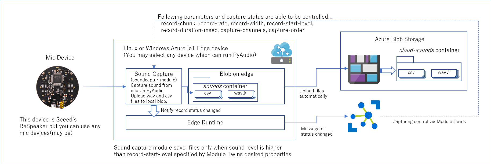

# マイクデバイスから音をWAVファイル、CSVファイル形式でキャプチャーし、クラウドにアップロードする 
このステップでは、以下の構成を構築する。 

 

## Build & Deploy 

1. [https://github.com/ms-iotkithol-jp/MicCaptureIoTSoundSample](https://github.com/ms-iotkithol-jp/MicCaptureIoTSoundSample)をcloneする 
1. cloneしたフォルダーをVS Code で開く 
1. SoundIoTEdgeSolution/.env を開き、4つの変数の'='の右側に、各自のAzure Container Registryのアドレス、ユーザーネーム、パスワードと、Azure Storage Account（Blob）の接続文字列をコピペして保存 
1. Azure IoT Edge Extensionの機能で、デフォルトのArchitectureを、arm32v7に変更する 
1. Azure IoT Edge Extensionの機能で、’Build and Push IoT Edge Solution'を使って、ModuleのBuild、BuildされたDocker ImageのAzure Container RegistryへのPushを行う 
1. Azure IoT Edge Extensionの機能で、'Create Deployment for Single Device'を使って、Azure IoT Edgeデバイスへのデプロイ指示を行う 

※ 本構成は Azure Blob on Edge を使うので、[Azure Blob on Edge のセットアップ方法](https://docs.microsoft.com/en-us/azure/iot-edge/how-to-deploy-blob) を参考に、Raspberry Pi 側で、Blob on Edge が実行可能なようセットアップを事前にしておくこと

## Sound Capture Module 機能詳細 
マイクデバイスの入力を、指定されたスペックと時間単位で、WAVファイルとCSVファイルを保存し、保存したファイルを Blob on Edge にアップロードする。アップロードされたファイルは、Blob on Edge の機能を使って、Azure上の Blob Storage に転送される。 

### 設定  
deployment.template.json での設定において、  

        "modules": {
          "soundcapturemodule": {
            "version": "1.0",
            "type": "docker",
            "status": "running",
            "restartPolicy": "always",
            "env": {
の下の一連の設定が、Docker Container 実行時の環境変数設定である。 

              "MIC_DEVICE_NAME":{
                "value": "ReSpeaker 4 Mic Array"
              },
              "MIC_DEVICE_NUM_OF_MIC":{
                "value": 4
              }
の、2つの環境変数が、Sound Capture Module に対する、使用するマイクデバイスの指定である。この設定は、Seeed の ReSpeaker 4 Mic Array 用の設定であり、他のマイクデバイスを利用したい場合は、適宜、変数の値を変えること。 

次に、194行目付近の、 

    "soundcapturemodule":{
      "properties.desired": {
        "capture-spec":{
          "record-chunk":1024,
          "record-rate":16000,
          "record-width":2,
          "record-start-level": 1000,
          "record-duration-msec":500,
          "capture-channels":"1,2,3,4",
          "capture-order": false
        }
      }
    }
が、サウンドキャプチャー時の設定である。以下の3つは、音のサンプリングに関する設定である。 

- record-chunk - サンプリングのチャンク数
- record-rate  - サンプリングレート
- record-width - データのバイト数

詳細は、[https://people.csail.mit.edu/hubert/pyaudio/docs/](https://people.csail.mit.edu/hubert/pyaudio/docs/)、または、[http://wiki.seeedstudio.com/ReSpeaker_Mic_Array_v2.0/](http://wiki.seeedstudio.com/ReSpeaker_Mic_Array_v2.0/)を参照のこと。 

残りは、 

- record-start-level - キャプチャーした音のレベルの絶対値が、この値より大きいときだけ、WAV、CSVファイルを保存・アップロード 
- record-duration-msec - 一ファイルに格納する音データの時間長 - ミリ秒単位
- capture-channels - サンプリングするマイクのチャネルの指定 
- capture-order - この値をtrueに設定すると、サウンドキャプチャーを行い、falseにすると、サウンドキャプチャーは行わない。 

であり、3番目の'chapter-channels' は、Seeed ReSpekar Mic Array V2.0 で、6_channels_firmware.bin を使っているので、4つのマイクデバイスが装備され、全部で6チャンネルの音源を利用できる。チャンネル1から4が、4つのマイクデバイスの入力に相当するので、ここでは、このような設定をしている。 

以上の値は、それぞれの利用シーンに応じて変更すること。 

### ファイル構成  
Sound Capture Module は、以下の3つのファイルから構成される。 
- miccapture.py - 指定された設定でマイクデバイスからの音をキャプチャー
- main.py - IoT Edge Runtime との通信、及び、MicCaptureクラスの起動
- fileupdater.py - MicCaptureクラスの音データキャプチャ時にコールされ、Blob on Edge に指定されたファイルをアップロードする 

miccapture.pyで定義された、MicCapture クラスは、Azure IoT Edge Runtime には依存しておらず、単体で独立して利用できる。よって、例えば、Azure IoT Edge Runtimeを動かすことができない（つまりDockerが実行不可能）ような、ローレベルのハードウェアで、[Azure IoT Device SDK for Python](https://github.com/azure/azure-iot-sdk-python) を使って Azure IoT Hub と通信するケースでも、再利用可能である。 
また、FileUpdaterクラスを使ってBlob on Edge への依存も隠ぺいしているので、本サンプルの Step 3 では、fileupdater.pyのみを変更することにより、ローカルに実装されたAI on Edge なモジュールへの、音データの受け渡しが可能になるよう設計されている。 
