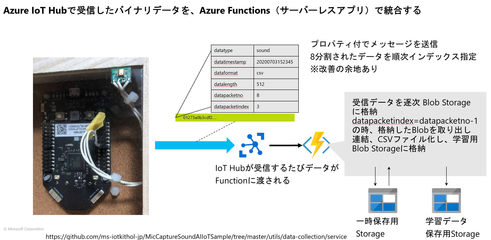

# Sound Data Composer Function 

To run this sample, please setup following environment variables.  

- AzureWebJobsStorage
- IoTHubConnectionString
- StorageConnectionString

It is OK that you use same value for both 'AzureWebJobsStorage' and 'StorageConnectionString'.
The value of 'IoTHubConnectionString' should be your IoT Hub RBAC 'service role' connection string. 

You can use this sample with [Azure Sphere Sound Capture Sample](https://github.com/ms-iotkithol-jp/azure-sphere-thief-detector) as an application on sound capturing and sending device.
