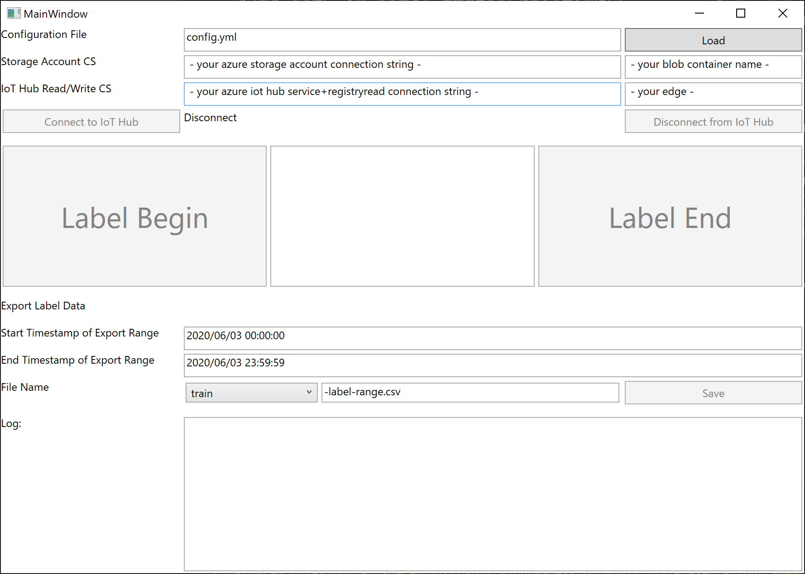

# Sound AI Label Creator  
[SoundAI/notebook](../../SoundAI/notebook)のAI学習で使う、学習データの定義ファイルの作成を支援するツール。  
- train-label-range.csv
- test-label-range.csv

[SoundIoTEdgeSolution/modules/SoundCaptreuModule](../../SoundIoTEdgeSolution/modules/SoundCaptreuModule) で学習用の音源をキャプチャーする際に、本ツールを使って、学習用ラベルに相当する音を収録している期間をマーキングする。  
マーキングは、Azure Storage Blob Container に格納され、格納したマーキング情報を元に、時間帯と対応するラベルを示すCSVファイルを作成する。

## How To  
Azure Storage Account を作成し、マーキング情報を格納するフォルダーを作成する。  
使用するIoT Edge Deviceが登録されたAzure IoT Hubに、ServiceとRegistry ReadWrite 権限を持ったロールを作成する。  
Azure Storage AccountのRBACの接続文字列と、作成したAzure IoT Hubの接続文字列を、config.ymlの該当する箇所にコピペする。  
使用するEdge DeviceのIdやBlob Containerの名前を追加する。  
分類したい音の種類に応じたラベルをconfig.ymlに定義する。  
SoundAILabelCreatorフォルダーで、  
```
dotnet run
```
でアプリを起動する。



1. config.yml をロード
2. IoT Hubにconnect
3. ラベルを選択して、Begin、収録、End を繰り返す
4. train または、testを選択して、Save


Beginをクリックすると、Edge Device上の Sound Capture Module のDesired Propertyのcapture-orderがTrueになり、収録とクラウドへの音ファイルのアップロードが始まる。Endをクリックすると、Falseになり、収録、及び、クラウドへのアップロードが止まる。

